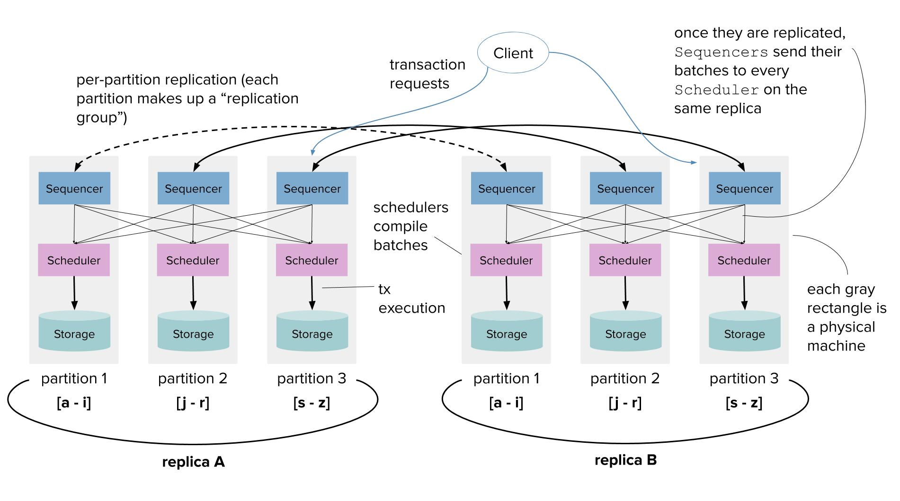
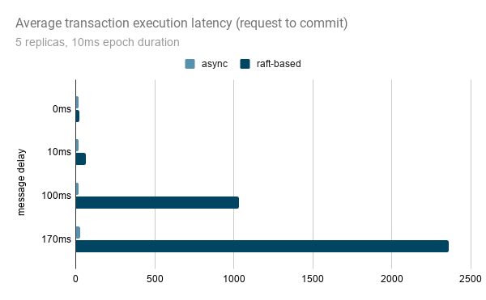
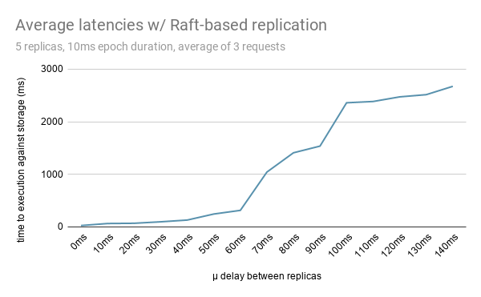

# Deterministic Distributed Transactions atop a Partitioned, Replicated KV Store

`@author andrii dobroshynskyi`

## Intro

- Implementation of a version of system proposed in the [Calvin](http://cs.yale.edu/homes/thomson/publications/calvin-sigmod12.pdf) paper - a partitioned key-value store in Elixir, supporting asynchronous and Raft-based synchronous replication of transactional input, designed to run on arbitrary shared-nothing machines

- Deterministic storage system - transaction client requests are agreed upon by designated components of the system and guaranteed to be executed by all replicas and corresponding partitions within each replica

## Quickstart

- `mix test` runs all tests in `apps/calvin/test`

- Some tests for specific behavior
    - `test/test_storage_async.exs` - tests consistency of `Storage` components on replicas when using `:async` replication of transactional input

    - `test/test_storage_raft.exs` - tests consistency of `Storage` components on replicas when using `:raft` replication of transactional input

    - `test/test_transactions_multipartition.exs` - tests multipartition txns within a single replica, including multiple transactions ordered as 'earlier'/'later' than one another for testing serializability (transaction ordered by a `Sequencer` component as occuring 'later' sees the state with 'earlier' writes applied and 'earlier' transaction doing READs does not see later transaction's WRITEs) 

- Experiments can be run from `apps/calvin/experiments` with `mix test experiments/<file>`

Elixir script in `balance_transfer.exs` executes simple 'balance transfer' multipartition transactions in form of

```
READ <- 'Alice', 'Zoe'

SET 'Alice' -= 10
SET 'Zoe' += 10
```

where the `Alice` record is stored on partition 1 and `Zoe` stored on partition 2, as the system does automatic partitioning of keys based on how many partitions are specified to a [`Configuration.new/2`](apps/calvin/lib/configuration.ex) via a [`PartitionScheme`](apps/calvin/lib/partitioning.ex).

Scripts in `with_async.exs` and `with_raft.exs` run experiments measuring execution latencies of txns with either `:async` or `:raft` replication mode

## Why Transactions and (Distributed) Txs?

- Multiple operations applied as an atomic unit, or none of them applied, storage system remains in consistent state

- When having multiple replicas that communicate via message passing, how do we ensure they stay in sync? What to do if a replica accepts a transaction but fails just before execution? What about in the middle of transaction execution?

## Why Deterministic storage systems?

- No fundamental reason why a transaction should abort amidst a nondeterministic event (machine failure or equivalent) - systems might do so from practical considerations

- If can agree on input to the system prior to beginning of execution, then on failure and subsequent recovery can
    - re-play input logged to disk __or__
    - recover from a fellow replica that is guaranteed to be executing the exact same transactional input

## What is the original Calvin paper about (simplified)?

- The original Calvin paper proposes a layer to run against a non-transactional storage system to transform it into “highly available” DB system supporting ACID transactions

- Splits time into epochs, transactions are batched

- Focuses on throughput, proposing to use a specific locking mechanism to ensure transactions execute in parallel (efficiently) but in agreed upon order against the storage layer

## Results & Some Experiments

- A working prototype of a replicated, partitioned key-value store based on the Calvin system



- Elixir Components for `Sequencer`, `Scheduler`, `Storage` that run as independent RSMs

- Every transaction computes its own write and read sets, data automatically partitioned according to the keys in the operations that determine these sets

- Replication mode specified as `:async` or `:raft`, every Sequencer maintains a Raft state that it uses to manage Raft-based replication

- Why need Raft? Async replication = very difficult failover when primary / main fails, want to use quorum for commit

- Transaction batches get forwarded to correct Schedulers at every epoch & interleaved

- Each storage node only contains the data that it needs to based on the partitioning scheme -
 during transaction execution the system figures out
    - Which transaction updates are “local” and which are not and executes accordingly
    - Which elements of the read set are local vs. remote and gathers/reads both the local and remote sets from participating partitions

| Chart 1                   | Chart 2                   |
|:-------------------------:|:-------------------------:|
|||


- Supports launch of arbitrary number of replicas partitioned against an arbitrary number of nodes per replica

- Lots of Elixir tests to make sure expected & consistent state & more in code!

## Some remaining questions

- Empty batches need to be replicated by design leading to halts with network delays when delay >> epoch time - ways to optimize?

- Load balancing client requests?

## Material / References

- Elixir documentation - especially [Enum](https://hexdocs.pm/elixir/Enum.html), [List](https://hexdocs.pm/elixir/List.html)
- Calvin Paper - [Thomson et al. '12](http://cs.yale.edu/homes/thomson/publications/calvin-sigmod12.pdf)
- Different print of Calvin paper - [Fast Distributed Transactions and Strongly Consistent Replication for OLTP Database Systems](http://www.cs.umd.edu/~abadi/papers/calvin-tods14.pdf)
- Paper preceding Calvin by same authors - [Thomson, Abadi VLDB '10](http://www.cs.umd.edu/~abadi/papers/determinism-vldb10.pdf)
- Paper with detailed analysis of the Calvin deterministic db system pros/cons implemented by same authors - [Ren, Thomson, Abadi VLDB '14](http://www.vldb.org/pvldb/vol7/p821-ren.pdf)
- Reading on transactions, recovery - [Concurrency Control and Recovery](https://dsf.berkeley.edu/cs262/2005/ccandr.pdf)
- Reading on atomicity, locking - [Principles of Computer System Design, Chapter 9](https://ocw.mit.edu/resources/res-6-004-principles-of-computer-system-design-an-introduction-spring-2009/online-textbook/atomicity_open_5_0.pdf)